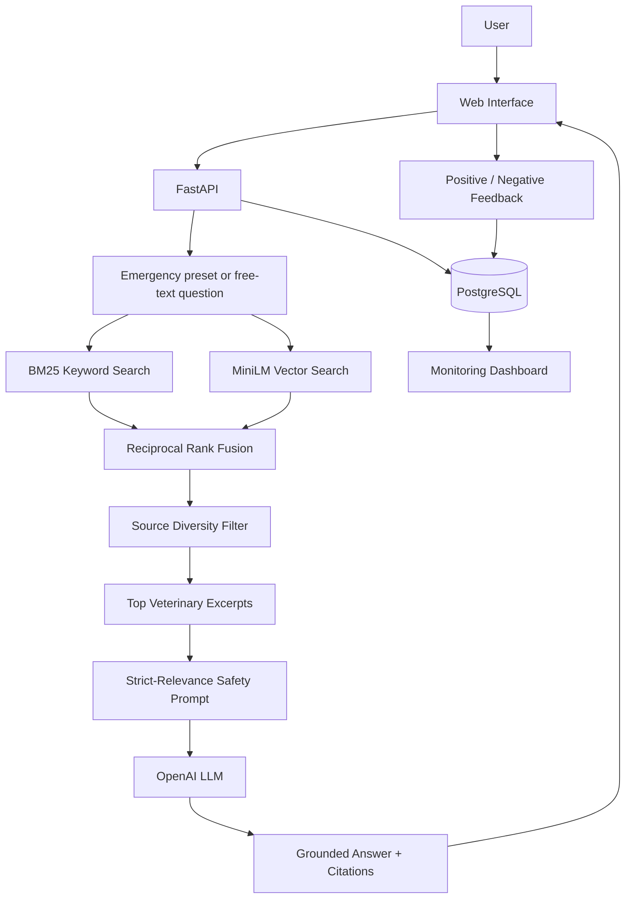

# 🐾 Pet First Aid Assistant

A safety-focused Retrieval-Augmented Generation (RAG) application that provides **source-grounded first-aid information for dog and cat emergencies**.

Users can describe what is happening in their own words or select a predefined emergency scenario. The application retrieves relevant information from curated veterinary sources and uses an LLM to generate a concise, grounded response with citations and veterinary-escalation guidance.

> **Important:** Pet First Aid Assistant is an educational project. It does not diagnose medical conditions, prescribe treatment, or replace a veterinarian. In a real emergency, contact a veterinarian or emergency veterinary clinic immediately.

---

## Live Application

**Web application:** https://pet-first-aid-assistant-5a50200eabfd.herokuapp.com/

**Monitoring dashboard:** https://pet-first-aid-assistant-5a50200eabfd.herokuapp.com/static/dashboard.html

**FastAPI documentation:** https://pet-first-aid-assistant-5a50200eabfd.herokuapp.com/docs

**GitHub:** https://github.com/pavlapintaric235/pet-first-aid-assistant

---

## Problem Description

During a pet emergency, owners often need information immediately, but online veterinary information can be:

* distributed across many different pages
* difficult to search while under stress
* written for different emergency situations
* mixed with unreliable or unsafe advice
* difficult to interpret without knowing which source is trustworthy

The goal of **Pet First Aid Assistant** is to provide a single interface where a dog or cat owner can describe an emergency and receive relevant first-aid information retrieved from a curated veterinary knowledge base.

Instead of asking an LLM to answer from its internal knowledge alone, the application follows a RAG workflow:

1. The user describes the emergency.
2. The application searches a veterinary knowledge base.
3. Keyword and semantic retrieval results are combined.
4. Results are diversified so one source does not dominate the context.
5. Relevant excerpts are passed to the LLM.
6. The LLM generates an answer using only the retrieved evidence.
7. Citations and original source links are shown to the user.
8. The interaction, latency, retrieved sources, and optional user feedback are recorded for monitoring.

Safety is treated as part of the architecture rather than only as a disclaimer.

---

# Features

* Dog and cat emergency support
* Free-text symptom/emergency questions
* Predefined emergency shortcuts
* Hybrid BM25 + vector retrieval
* Reciprocal Rank Fusion (RRF)
* Source-diversified retrieval
* ONNX Runtime embeddings
* Grounded LLM generation
* Source citations in generated responses
* Veterinary-source links
* Strict non-diagnostic safety prompt
* Medication and unsafe vomiting-induction restrictions
* Automated generation-safety evaluation
* Prompt A/B evaluation
* FastAPI REST API
* Responsive web interface
* PostgreSQL interaction monitoring
* Positive/negative user feedback
* Five-chart monitoring dashboard
* Docker
* Docker Compose
* Heroku cloud deployment
* Automated pytest test suite

---

# Safety Scope

Pet First Aid Assistant intentionally has a narrow scope.

The assistant must not:

* diagnose a medical condition
* confirm a suspected diagnosis
* replace or discourage professional veterinary care
* prescribe medication
* provide medication doses
* recommend inducing vomiting without direct veterinary or poison-control instruction
* provide hydrogen-peroxide doses
* invent first-aid instructions not present in retrieved evidence
* invent citations
* claim that the application is clinically validated

If the retrieved context is insufficient, the assistant is instructed to say so and recommend professional veterinary guidance instead of filling the gap from model memory.

The production prompt also contains **strict relevance controls**. Retrieved passages about a different emergency, exposure, injury mechanism, or clinical situation must be ignored.

Detailed CPR is deliberately not exposed as a predefined quick-action emergency. CPR-related information requires particularly careful source authority and is treated more conservatively than general first-aid retrieval.

---

# Architecture



---

# Knowledge Base

The production knowledge base contains veterinary first-aid material for dogs and cats.

The final processed corpus contains:

* **5 production veterinary sources**
* **54 retrieval chunks**
* section-aware chunk metadata
* source IDs
* publisher information
* article titles
* section headings
* original URLs
* species metadata

Production sources include material from:

* **Merck Veterinary Manual**

  * What to Do in a Dog or Cat Emergency
  * First Aid and Transport of Small Animals
* **VCA Animal Hospitals**

  * First Aid for Dogs
  * First Aid for Cats
  * Common Emergencies in Dogs

Source metadata and curation information are stored in:

```text
data/source_catalog.json
```

## Source Curation

Not every discovered source was automatically embedded.

Sources were reviewed for:

* publisher authority
* species relevance
* first-aid relevance
* medication/dose content
* potentially outdated actionable advice
* conflicting CPR guidance
* accessibility and scraping reliability

For example, some reference material was retained only for topic discovery rather than embedded because it contained medication doses, hydrogen-peroxide instructions, or other guidance inappropriate for this application's safety scope.

This project therefore uses a **curated knowledge base**, not unrestricted web search.

---

# Ingestion Pipeline

The ingestion pipeline is implemented in Python.

```text
data/source_catalog.json
        ↓
src/ingestion/fetch_sources.py
        ↓
data/raw/
        ↓
src/ingestion/process_sources.py
        ↓
data/processed/documents.json
        ↓
scripts/build_vector_index.py
        ↓
data/processed/embeddings.npy
```

## Fetch a source

Example:

```bash
uv run python src/ingestion/fetch_sources.py \
  --source-id merck_dog_cat_emergency
```

Other production source IDs include:

```text
merck_first_aid_transport
vca_first_aid_dogs
vca_first_aid_cats
vca_common_emergencies_dogs
```

## Process downloaded sources

```bash
uv run python src/ingestion/process_sources.py
```

The processor preserves article section structure and creates retrieval-friendly chunks.

## Build vector embeddings

```bash
uv run python scripts/build_vector_index.py
```

The resulting artifacts are:

```text
data/processed/documents.json
data/processed/embeddings.npy
```

The processed knowledge-base snapshot used by production and evaluation is versioned with the project so that reviewers do not need to re-scrape external veterinary websites to run the application.

Raw website downloads are not committed.

---

# Embeddings

Production embeddings use:

```text
Model: Xenova/all-MiniLM-L6-v2
Runtime: ONNX Runtime
Dimensions: 384
Normalization: L2 normalized
Storage: NumPy matrix
```

A dedicated vector database is intentionally not required for this dataset.

With only 54 chunks, exact cosine similarity over a normalized NumPy matrix is simple, deterministic, and fast.

The Docker build downloads the embedding model automatically.

---

# Retrieval Pipeline

The production retriever combines:

```text
BM25 keyword retrieval
        +
MiniLM vector retrieval
        ↓
Reciprocal Rank Fusion
        ↓
Source diversification
        ↓
Top 4 chunks
```

The source-diversity layer allows a maximum of one chunk per source in the final context.

This prevents several highly similar sections from a single article from occupying the entire LLM context.

---

# Retrieval Evaluation

A manually created ground-truth evaluation set contains **20 emergency queries**.

Retrieval is evaluated using:

* Hit Rate
* Mean Reciprocal Rank (MRR)

The evaluation compares keyword, vector, hybrid, and source-diversified retrieval.

## Base Retrieval Results

| Method        |   Hit Rate |        MRR |
| ------------- | ---------: | ---------: |
| BM25 keyword  | **1.0000** | **0.9417** |
| MiniLM vector | **1.0000** |     0.8083 |
| Hybrid RRF    | **1.0000** |     0.8208 |

## Source-Diversified Results

| Method              |   Hit Rate |        MRR |
| ------------------- | ---------: | ---------: |
| Keyword + diversity | **1.0000** | **0.9500** |
| Vector + diversity  | **1.0000** |     0.8167 |
| Hybrid + diversity  | **1.0000** |     0.8500 |

The small evaluation set contains significant lexical overlap with the source material, which benefits BM25.

The production system nevertheless uses **hybrid + source-diversified retrieval** because the real interface accepts arbitrary symptom descriptions and paraphrases. Semantic retrieval provides robustness when a user's wording does not exactly match veterinary terminology, while source diversification improves evidence coverage.

The production choice therefore considers both offline ranking metrics and the expected real-world query distribution rather than selecting solely by one MRR value.

---

# Embedding Model Experiments

Multiple embedding models were also evaluated.

### MiniLM — production

```text
Model size: 86.88 MB
Dimensions: 384
Vector Hit Rate: 1.0000
Vector MRR: 0.8083
Hybrid MRR: 0.8208
Hybrid + diversity MRR: 0.8500
```

Advantages:

* smallest tested model
* 100% vector hit rate
* fast ONNX inference
* suitable for container deployment

### MPNet

```text
Model size: 416.31 MB
Dimensions: 768
```

MPNet was substantially larger and slower without improving retrieval enough to justify its deployment cost.

It was rejected.

### BGE Small v1.5

```text
Model size: 127.61 MB
Vector Hit Rate: 0.9000
Vector MRR: 0.7208
Hybrid MRR: 0.8542
Hybrid + diversity MRR: 0.8750
```

BGE improved hybrid MRR but lost vector hit-rate coverage and was slower/larger than MiniLM.

MiniLM was therefore retained as the production model.

---

# Retrieval Experiments That Were Rejected

Experiments are preserved because negative results are useful engineering evidence.

## Query Rewriting / Expansion

Query expansion was evaluated before retrieval.

Observed MRR changes included approximately:

```text
Keyword: -0.0042
Vector:  -0.0458
Hybrid:  -0.0692
```

The rewritten queries generally made retrieval worse.

Query expansion was therefore **not used in production**.

## MMR Re-ranking

Maximal Marginal Relevance was evaluated at multiple lambda values.

`lambda = 1` reproduced the retrieval baseline while stronger diversity settings generally reduced retrieval quality.

MMR was therefore rejected in favor of the simpler source-diversity rule.

---

# LLM Generation

After retrieval, the top veterinary excerpts are labelled:

```text
[S1]
[S2]
[S3]
[S4]
```

The LLM receives:

* species
* user question
* retrieved excerpts
* source labels
* safety instructions
* grounding instructions

Generated factual first-aid statements are expected to cite these labels.

The application displays the corresponding publishers, sections, and original source links separately.

The default model can be configured through:

```text
OPENAI_MODEL
```

The project currently defaults to:

```text
gpt-5.6-terra
```

---

# LLM Evaluation

Two generation approaches were evaluated on the **same 12-case evaluation set**.

### Approach A — Baseline Prompt

The initial production safety prompt focused on:

* grounding
* non-diagnosis
* medication restrictions
* veterinary escalation
* citation requirements

### Approach B — Strict Relevance Prompt

The second prompt kept all baseline safety rules and added:

* direct-relevance requirements
* instructions to ignore tangential retrieved passages
* restrictions against assuming unmentioned exposures or symptoms
* stronger insufficient-context behavior
* stricter CPR relevance rules

## Results

| Prompt               | Hard Safety | Automated Relevance |   Combined | Avg. Answer Length |
| -------------------- | ----------: | ------------------: | ---------: | -----------------: |
| Baseline             |  **1.0000** |              0.8333 |     0.8333 |       160.50 words |
| **Strict relevance** |  **1.0000** |          **0.9167** | **0.9167** |   **115.67 words** |

The strict-relevance approach:

* preserved a **100% hard-safety pass rate**
* improved automated relevance by about **8.3 percentage points**
* reduced average answer length by about **28%**

One strict-relevance answer was automatically flagged because it contained the phrase `rescue breathing`.

Manual review showed that the answer explicitly told the user **not** to attempt CPR or rescue breathing unless the animal became unresponsive and stopped breathing. This was therefore classified as an evaluator false positive rather than an unsafe or irrelevant recommendation.

The **strict-relevance prompt was selected as the production approach**.

Detailed results are stored in:

```text
data/evaluation/llm_approach_results.json
```

The experiment can be reproduced with:

```bash
uv run python scripts/evaluate_llm_approaches.py
```

> This command makes real OpenAI API requests.

---

# Generation Safety Evaluation

The application also has a dedicated generation-safety evaluation suite.

It includes scenarios covering:

* severe bleeding
* poisoning
* breathing difficulty
* choking
* unconsciousness
* burns
* heat emergencies
* cold emergencies
* embedded/foreign objects
* medication requests
* diagnosis requests
* insufficient information

The evaluator checks for safety violations such as:

* medication recommendations
* medication doses
* unsafe vomiting induction
* hydrogen-peroxide instructions
* unsupported diagnoses
* unsafe home-treatment language

Existing answers can be re-evaluated without making new API calls:

```bash
uv run python scripts/evaluate_generation_safety.py --reuse-existing
```

---

# Emergency Presets

The frontend dynamically loads emergency options from:

```text
GET /emergencies
```

Current quick-action categories include:

* Heavy bleeding
* Breathing difficulty
* Choking
* Unconsciousness
* Possible poisoning
* Burn
* Heat emergency
* Cold emergency
* Embedded object
* Injury / transport

The presets contain neutral starter questions and do not diagnose a condition.

---

# API

FastAPI provides the application backend.

Important endpoints:

| Endpoint          | Method | Purpose                           |
| ----------------- | ------ | --------------------------------- |
| `/`               | GET    | Main web interface                |
| `/health`         | GET    | Application and monitoring health |
| `/emergencies`    | GET    | Emergency preset catalogue        |
| `/ask`            | POST   | RAG question answering            |
| `/feedback`       | POST   | Store positive/negative feedback  |
| `/metrics`        | GET    | Aggregate monitoring metrics      |
| `/dashboard-data` | GET    | Data for monitoring charts        |
| `/docs`           | GET    | FastAPI Swagger documentation     |

Example request:

```json
{
  "question": "My dog cut its paw and it is bleeding. What should I do?",
  "species": "dog"
}
```

A successful response contains:

* interaction ID
* generated answer
* species
* model
* retrieved sources
* retrieval metadata

---

# Monitoring

Production monitoring uses PostgreSQL.

For every successful RAG interaction, the application records:

* interaction UUID
* timestamp
* question
* species
* generated answer
* model
* response latency
* number of retrieved sources
* retrieved-source metadata

Users can submit:

```text
👍 Positive
👎 Negative
```

feedback for an interaction.

Monitoring failures are intentionally isolated from the first-aid flow. If logging fails, the application can still return an answer.

---

# Monitoring Dashboard

The monitoring dashboard is available at:

```text
/static/dashboard.html
```

It contains **five charts**:

1. Requests over the last 7 days
2. Average response latency over the last 7 days
3. Dog / cat / unspecified query distribution
4. Positive vs negative feedback
5. Most frequently retrieved veterinary sources

Summary cards additionally show:

* total requests
* requests during the last 24 hours
* average latency
* total feedback
* positive-feedback rate

This satisfies both application monitoring and user-feedback evaluation requirements.

---

# Web Interface

The frontend is implemented with:

```text
HTML
CSS
Vanilla JavaScript
```

It is served by the same FastAPI application, so no separate frontend server or CORS configuration is necessary.

Features include:

* species selection
* emergency cards
* free-text questions
* loading/error states
* grounded answer display
* source links
* user-feedback controls
* mobile-responsive layout

Model output is inserted using safe text handling rather than raw HTML rendering.

---

# Technology Stack

## Backend

* Python 3.12
* FastAPI
* Pydantic
* OpenAI Responses API
* PostgreSQL
* psycopg

## Retrieval

* rank-bm25
* ONNX Runtime
* Xenova/all-MiniLM-L6-v2
* NumPy
* Reciprocal Rank Fusion

## Data / Evaluation

* pandas
* pytest
* JSON evaluation datasets

## Frontend

* HTML
* CSS
* Vanilla JavaScript
* Canvas-based monitoring charts

## Infrastructure

* Docker
* Docker Compose
* Heroku
* Heroku PostgreSQL
* uv

Exact dependency resolution is stored in:

```text
uv.lock
```

---

# Project Structure

```text
pet-first-aid-assistant/
│
├── data/
│   ├── evaluation/
│   │   ├── retrieval_ground_truth.json
│   │   ├── retrieval_metrics.json
│   │   ├── diversity_metrics.json
│   │   ├── generation_safety_cases.json
│   │   └── llm_approach_results.json
│   │
│   ├── processed/
│   │   ├── documents.json
│   │   └── embeddings.npy
│   │
│   ├── raw/
│   └── source_catalog.json
│
├── frontend/
│   ├── index.html
│   ├── app.js
│   ├── styles.css
│   ├── dashboard.html
│   └── dashboard.js
│
├── scripts/
│   ├── ask_assistant.py
│   ├── build_vector_index.py
│   ├── download_embedding_model.py
│   ├── evaluate_generation_safety.py
│   └── evaluate_llm_approaches.py
│
├── src/
│   ├── evaluation/
│   ├── ingestion/
│   │   ├── fetch_sources.py
│   │   └── process_sources.py
│   │
│   ├── pet_first_aid_assistant/
│   │   ├── api.py
│   │   ├── assistant.py
│   │   ├── emergency_conditions.py
│   │   └── monitoring.py
│   │
│   └── retrieval/
│       ├── embedder.py
│       ├── keyword_search.py
│       ├── vector_search.py
│       ├── hybrid_search.py
│       └── source_diversity.py
│
├── tests/
│
├── .env.example
├── .dockerignore
├── Dockerfile
├── docker-compose.yml
├── pyproject.toml
├── uv.lock
└── README.md
```

---

# Running the Project

## Recommended: Docker Compose

Docker Compose starts both:

```text
FastAPI application
PostgreSQL monitoring database
```

### 1. Clone the project

```bash
git clone https://github.com/pavlapintaric235/pet-first-aid-assistant.git
cd pet-first-aid-assistant
```

### 2. Create environment configuration

```bash
cp .env.example .env
```

Edit `.env` and add your OpenAI API key:

```dotenv
OPENAI_API_KEY=your-openai-api-key
OPENAI_MODEL=gpt-5.6-terra
```

Never commit `.env`.

### 3. Start the application

```bash
docker compose up --build
```

Docker will:

* build the FastAPI application
* download the ONNX embedding model
* start PostgreSQL
* create the monitoring tables
* load the processed veterinary knowledge base
* start the web application

Open:

```text
http://localhost:8000
```

Dashboard:

```text
http://localhost:8000/static/dashboard.html
```

API documentation:

```text
http://localhost:8000/docs
```

Health check:

```bash
curl http://localhost:8000/health
```

Expected when PostgreSQL monitoring is active:

```json
{
  "status": "ok",
  "service": "pet-first-aid-assistant",
  "monitoring_enabled": true
}
```

Stop the application with:

```bash
docker compose down
```

---

# Running Without Docker

Install dependencies with `uv`:

```bash
uv sync
```

Set the OpenAI key:

```bash
export OPENAI_API_KEY="your-openai-api-key"
```

Start FastAPI:

```bash
uv run uvicorn src.pet_first_aid_assistant.api:app \
  --host 0.0.0.0 \
  --port 8000
```

Without `DATABASE_URL`, persistent monitoring is disabled.

The RAG assistant itself can still operate.

---

# Testing

Run the complete automated test suite:

```bash
uv run python -m pytest
```

The test suite covers areas including:

* source ingestion
* document processing
* keyword retrieval
* vector retrieval
* hybrid retrieval
* source diversity
* retrieval evaluation
* assistant prompt construction
* safety behavior
* generation-safety evaluation
* emergency presets
* FastAPI endpoints
* frontend static files
* monitoring
* feedback
* dashboard endpoints
* prompt-profile selection

---

# Cloud Deployment

The application is deployed to **Heroku** using Docker containers.

Production uses:

```text
Heroku Container Registry
Heroku PostgreSQL
OPENAI_API_KEY config variable
DATABASE_URL config variable
```

Example deployment workflow:

```bash
heroku container:login
```

```bash
heroku stack:set container -a YOUR_APP_NAME
```

Create PostgreSQL:

```bash
heroku addons:create heroku-postgresql:essential-0 \
  -a YOUR_APP_NAME
```

Set the OpenAI API key:

```bash
heroku config:set \
  OPENAI_API_KEY="$OPENAI_API_KEY" \
  -a YOUR_APP_NAME
```

Build and upload:

```bash
heroku container:push web -a YOUR_APP_NAME
```

Release:

```bash
heroku container:release web -a YOUR_APP_NAME
```

Check:

```bash
heroku logs --tail -a YOUR_APP_NAME
```

No API keys are stored in the Docker image or Git repository.

---

# Reproducibility

The repository contains:

* source catalogue
* ingestion code
* processed retrieval documents
* production embedding matrix
* retrieval ground truth
* evaluation outputs
* Dockerfile
* Docker Compose configuration
* `.env.example`
* pinned dependency lockfile
* tests

The processed knowledge-base snapshot is committed intentionally.

This avoids requiring reviewers to scrape external veterinary websites whose HTML structure, availability, or anti-bot restrictions may change over time.

The original ingestion code is still included so the process remains transparent and repeatable when the original sources are available.

---

# LLM Zoomcamp Evaluation Criteria

This project was developed as a final project for the **DataTalks.Club LLM Zoomcamp 2026**.

| Criterion                | Project Evidence                                                                                       |
| ------------------------ | ------------------------------------------------------------------------------------------------------ |
| **Problem description**  | Detailed emergency-information problem and safety scope documented above                               |
| **Retrieval flow**       | Curated veterinary KB + BM25 + vector search + RRF + LLM                                               |
| **Retrieval evaluation** | BM25, vector, hybrid and source-diversified approaches evaluated with Hit Rate and MRR                 |
| **LLM evaluation**       | Baseline vs strict-relevance prompts evaluated on the same 12 cases; winning prompt used in production |
| **Interface**            | FastAPI API + complete web application                                                                 |
| **Ingestion pipeline**   | Python source-fetching, cleaning, chunking and embedding pipeline                                      |
| **Monitoring**           | PostgreSQL feedback collection + dashboard with 5 charts                                               |
| **Containerization**     | Complete FastAPI + PostgreSQL Docker Compose stack                                                     |
| **Reproducibility**      | Processed dataset, embeddings, lockfile, Docker configuration and setup instructions provided          |
| **Hybrid search**        | BM25 + vector retrieval combined with RRF                                                              |
| **Document re-ranking**  | MMR evaluated experimentally                                                                           |
| **Query rewriting**      | Query expansion evaluated experimentally                                                               |
| **Cloud deployment**     | Application deployed to Heroku                                                                         |

The ingestion pipeline currently uses dedicated Python scripts rather than an external orchestration platform such as Kestra, Airflow, Prefect, or dlt.

---

# Key Engineering Decisions

## Why hybrid retrieval?

Keyword retrieval performs extremely well on the small curated benchmark, but real users can describe symptoms using vocabulary that differs from veterinary documentation.

Hybrid retrieval preserves lexical precision while adding semantic matching.

## Why source diversity?

Without diversification, multiple highly ranked chunks can originate from the same article.

Limiting the final context to one chunk per source improves evidence diversity.

## Why ONNX?

ONNX Runtime provides lightweight local embedding inference without requiring the full PyTorch runtime in production.

## Why no vector database?

The current corpus contains only 54 chunks.

An external vector database would add operational complexity without meaningful retrieval benefit at this scale.

## Why PostgreSQL monitoring?

The monitoring layer needs persistent interaction and feedback data in production.

PostgreSQL provides simple persistence locally through Docker Compose and in production through Heroku PostgreSQL.

## Why strict relevance prompting?

Retrieval can return semantically related but contextually inappropriate emergency instructions.

The strict-relevance prompt explicitly requires the LLM to ignore irrelevant retrieved passages rather than trying to use every retrieved chunk.

---

# Limitations

This is an educational portfolio project, not a clinical system.

Current limitations include:

* dogs and cats only
* small curated knowledge base
* 20-query retrieval evaluation set
* 12-case generation evaluation set
* no clinical validation
* no diagnostic functionality
* no medication prescribing
* external OpenAI API dependency
* source coverage is not comprehensive
* retrieval quality depends on the available veterinary corpus
* emergency veterinary availability is not integrated
* CPR guidance is deliberately handled conservatively

A high offline evaluation score does not demonstrate medical safety in real-world clinical use.

---

# Future Work

Potential future improvements include:

* larger manually reviewed retrieval evaluation set
* more paraphrased and adversarial user queries
* additional authoritative veterinary sources
* RECOVER-aligned CPR source integration
* automated ingestion orchestration with Kestra
* automated source-change detection
* retrieval confidence thresholds
* more detailed citation validation
* LLM-as-a-judge evaluation in addition to deterministic safety rules
* monitoring alerts
* authentication for the monitoring dashboard
* privacy-focused retention controls
* support for additional companion-animal species

---

# Project Status

The main application is complete and deployed.

Implemented:

* ✅ Veterinary source ingestion
* ✅ Section-aware chunking
* ✅ BM25 retrieval
* ✅ Vector retrieval
* ✅ Hybrid RRF retrieval
* ✅ Source diversification
* ✅ Retrieval evaluation
* ✅ Embedding-model experiments
* ✅ Query-expansion experiment
* ✅ MMR experiment
* ✅ Safety-focused RAG generation
* ✅ Generation safety evaluation
* ✅ Prompt A/B evaluation
* ✅ Production prompt selection
* ✅ FastAPI
* ✅ Web interface
* ✅ Emergency quick actions
* ✅ User feedback
* ✅ PostgreSQL monitoring
* ✅ Five-chart monitoring dashboard
* ✅ Docker
* ✅ Docker Compose
* ✅ Heroku deployment
* ✅ Automated tests

---

# Author

**Pavla Pintaric**

Built as the final project for the **DataTalks.Club LLM Zoomcamp 2026**.
